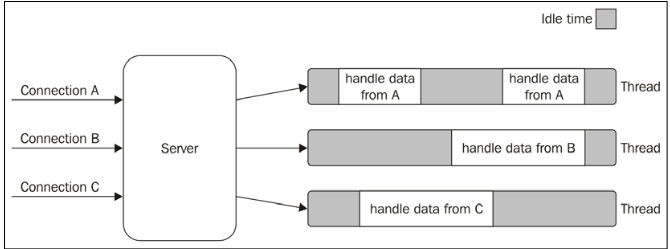
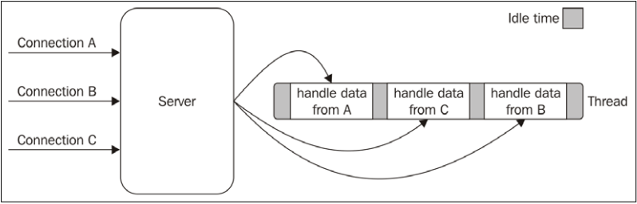

# 🚀 Understanding Node.js Execution Model

Node.js is built on a **single-threaded, non-blocking I/O model**, making it efficient for handling concurrent operations. Let's break down the concepts that shape its architecture.

---

## 🕒 I/O is Slow

I/O (Input/Output) operations are the slowest among fundamental computing tasks:

- **Memory Access (RAM):** Happens in nanoseconds (ns) with high-speed transfer rates in **GB/s**.
- **Disk & Network Access:** Takes milliseconds (ms) and operates at speeds ranging from **MB/s to GB/s**.
- **I/O Delay:** Not CPU-intensive but affected by the time it takes for a device to **respond**.
- **Human Factor:** Some I/O operations (e.g., mouse clicks, keyboard input) depend on humans, making response times **unpredictable** and even slower than disk or network speeds.

---

## ⛔ Blocking I/O: The Traditional Approach

In traditional programming, an **I/O request blocks** execution until it completes. This means the thread remains idle, waiting for data, reducing efficiency.

### 🔹 Example: Blocking I/O in a Web Server

```js
// Blocks the thread until data is available
data = socket.read();
// Data is available, now process it
console.log(data);
```

### 🔹 Problem with Blocking I/O
- A web server using blocking I/O can handle only **one connection per thread**.
- To handle multiple connections, we must **create a new thread per request**, leading to **high memory usage and context-switching overhead**.

### 🔹 Visual Representation



- Each request (`A, B, C`) gets a **separate thread**.
- **Gray sections** show idle time (waiting for I/O).
- Threads waste **CPU resources** when blocked.
- **Inefficient for high-concurrency applications**.

---

## ⚡ Non-Blocking I/O: A Smarter Approach

Non-blocking I/O improves efficiency by allowing multiple operations to proceed **without waiting** for one to finish before starting the next.

### 🔹 How It Works

Instead of waiting for an I/O operation (e.g., reading a file or network request), the system **immediately returns control** and allows other tasks to run.

### 🔹 Example: Enabling Non-Blocking I/O in Unix/Linux

```c
fcntl(socket, F_SETFL, O_NONBLOCK);
```

- **O_NONBLOCK flag:** Enables non-blocking mode.
- If no data is available, the call **returns immediately** with a special error code (`EAGAIN`).
- The application must **check later** when data is available.

### 🔹 Busy-Waiting: A Flawed Non-Blocking Pattern

A simple way to handle non-blocking I/O is **busy-waiting**, where the program repeatedly checks for available data.

```js
resources = [socketA, socketB, fileA];
while (!resources.isEmpty()) {
  for (resource of resources) {
    data = resource.read();
    if (data === NO_DATA_AVAILABLE) continue;
    if (data === RESOURCE_CLOSED) resources.remove(i);
    else consumeData(data);
  }
}
```

### 🔹 Why Busy-Waiting is Bad
1. **Wastes CPU cycles** – Continuously checking resources even when idle.
2. **Not scalable** – More tasks worsen performance.
3. **Unnecessary workload** – Instead of waiting efficiently, CPU time is wasted.

---

## 🔄 Event Demultiplexing: The Node.js Approach

Instead of busy-waiting, modern operating systems provide a **synchronous event demultiplexer**, also called an **Event Notification Interface**.

### 🔹 What is Multiplexing & Demultiplexing?
- **Multiplexing** = Combining multiple signals into one for efficient transmission.
- **Demultiplexing** = Splitting the combined signal back into separate components.

### 🔹 Real-World Example
Think of a **TV provider**:
1. They combine multiple TV channels into a single signal (**multiplexing**).
2. Your TV separates the channels, allowing you to watch different programs (**demultiplexing**).

### 🔹 How It Works in Node.js
- A **single thread manages multiple I/O resources** (files, sockets, network requests).
- Instead of manually checking each resource (busy-waiting), **event demultiplexing** waits for events **efficiently**.
- The **event loop** processes only the **ready** resources, avoiding unnecessary CPU usage.

### 🔹 Example: Using an Event Demultiplexer

```js
watchedList.add(socketA, FOR_READ); // (1)
watchedList.add(fileB, FOR_READ);

while ((events = demultiplexer.watch(watchedList))) { // (2)
  for (event of events) { // (3)
    data = event.resource.read();
    if (data === RESOURCE_CLOSED) demultiplexer.unwatch(event.resource);
    else consumeData(data);
  }
}
```

### 🔹 Step-by-Step Breakdown

#### 1️⃣ Adding Resources to Watchlist
```js
watchedList.add(socketA, FOR_READ);
watchedList.add(fileB, FOR_READ);
```
- Informs the system to **monitor specific resources** (socketA, fileB).
- The system will notify us **when they are ready** for reading.

#### 2️⃣ Blocking Until an Event Occurs
```js
while (events = demultiplexer.watch(watchedList))
```
- Unlike **busy-waiting**, this function **blocks efficiently** until data is available.
- **No CPU wastage** – the system pauses execution until an event occurs.

#### 3️⃣ Processing Only Ready Resources
```js
for (event of events) {
  data = event.resource.read();
}
```
- No unnecessary looping.
- The demultiplexer **only returns resources that are ready**, ensuring efficient processing.

#### 4️⃣ Handling Data or Closing Resources
```js
if (data === RESOURCE_CLOSED) {
  demultiplexer.unwatch(event.resource);
} else {
  consumeData(data);
}
```
- If a resource is closed, it’s **removed from the watchlist**.
- Otherwise, the data is processed.

---

## 🍽️ Visualizing the Event Loop: The Waiter Analogy

Imagine a **restaurant with one waiter**:
1. Instead of **checking every table** one by one, the waiter **waits for customers to call them**.
2. When a **customer is ready**, the waiter **takes the order**.
3. The waiter doesn't waste time **standing around** – they respond **only when needed**.

This is exactly how the **event loop** in Node.js works!



---

## 🎯 Key Takeaways
✅ Traditional **blocking I/O** wastes resources and limits concurrency.
✅ **Non-blocking I/O** enables multiple tasks to run efficiently but needs event-driven handling.
✅ **Busy-waiting is inefficient** – it wastes CPU cycles by continuously checking for updates.
✅ **Event Demultiplexing** ensures **optimal performance** by handling I/O **only when needed**.
✅ **Node.js event loop** is built on this model, allowing **scalable, high-performance applications**.