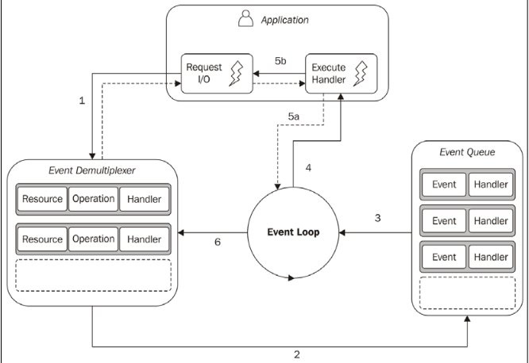
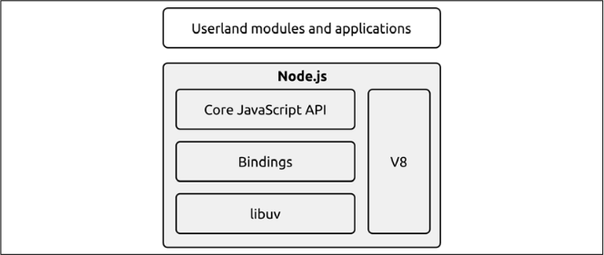

# 🚀 Understanding Node.js Execution Model

Node.js is built on a **single-threaded, non-blocking I/O model**, making it efficient for handling concurrent operations. Let's break down the concepts that shape its architecture.

---

## 🕒 I/O is Slow

I/O (Input/Output) operations are the slowest among fundamental computing tasks:

- **Memory Access (RAM):** Happens in nanoseconds (ns) with high-speed transfer rates in **GB/s**.
- **Disk & Network Access:** Takes milliseconds (ms) and operates at speeds ranging from **MB/s to GB/s**.
- **I/O Delay:** Not CPU-intensive but affected by the time it takes for a device to **respond**.
- **Human Factor:** Some I/O operations (e.g., mouse clicks, keyboard input) depend on humans, making response times **unpredictable** and even slower than disk or network speeds.

---

## ⛔ Blocking I/O: The Traditional Approach

In traditional programming, an **I/O request blocks** execution until it completes. This means the thread remains idle, waiting for data, reducing efficiency.

### 🔹 Example: Blocking I/O in a Web Server

```js
// Blocks the thread until data is available
data = socket.read();
// Data is available, now process it
console.log(data);
```

### 🔹 Problem with Blocking I/O

- A web server using blocking I/O can handle only **one connection per thread**.
- To handle multiple connections, we must **create a new thread per request**, leading to **high memory usage and context-switching overhead**.

### 🔹 Visual Representation


- Each request (`A, B, C`) gets a **separate thread**.
- **Gray sections** show idle time (waiting for I/O).
- Threads waste **CPU resources** when blocked.
- **Inefficient for high-concurrency applications**.

---

## ⚡ Non-Blocking I/O: A Smarter Approach

Non-blocking I/O improves efficiency by allowing multiple operations to proceed **without waiting** for one to finish before starting the next.

### 🔹 How It Works

Instead of waiting for an I/O operation (e.g., reading a file or network request), the system **immediately returns control** and allows other tasks to run.

### 🔹 Example: Enabling Non-Blocking I/O in Unix/Linux

```c
fcntl(socket, F_SETFL, O_NONBLOCK);
```

- **O_NONBLOCK flag:** Enables non-blocking mode.
- If no data is available, the call **returns immediately** with a special error code (`EAGAIN`).
- The application must **check later** when data is available.

### 🔹 Busy-Waiting: A Flawed Non-Blocking Pattern

A simple way to handle non-blocking I/O is **busy-waiting**, where the program repeatedly checks for available data.

```js
resources = [socketA, socketB, fileA];
while (!resources.isEmpty()) {
  for (resource of resources) {
    data = resource.read();
    if (data === NO_DATA_AVAILABLE) continue;
    if (data === RESOURCE_CLOSED) resources.remove(i);
    else consumeData(data);
  }
}
```

### 🔹 Why Busy-Waiting is Bad

1. **Wastes CPU cycles** – Continuously checking resources even when idle.
2. **Not scalable** – More tasks worsen performance.
3. **Unnecessary workload** – Instead of waiting efficiently, CPU time is wasted.

---

## 🔄 Event Demultiplexing: The Node.js Approach

Instead of busy-waiting, modern operating systems provide a **synchronous event demultiplexer**, also called an **Event Notification Interface**.

### 🔹 What is Multiplexing & Demultiplexing?

- **Multiplexing** = Combining multiple signals into one for efficient transmission.
- **Demultiplexing** = Splitting the combined signal back into separate components.

### 🔹 Real-World Example

Think of a **TV provider**:

1. They combine multiple TV channels into a single signal (**multiplexing**).
2. Your TV separates the channels, allowing you to watch different programs (**demultiplexing**).

### 🔹 How It Works in Node.js

- A **single thread manages multiple I/O resources** (files, sockets, network requests).
- Instead of manually checking each resource (busy-waiting), **event demultiplexing** waits for events **efficiently**.
- The **event loop** processes only the **ready** resources, avoiding unnecessary CPU usage.

### 🔹 Example: Using an Event Demultiplexer

```js
watchedList.add(socketA, FOR_READ); // (1)
watchedList.add(fileB, FOR_READ);

while ((events = demultiplexer.watch(watchedList))) {
  // (2)
  for (event of events) {
    // (3)
    data = event.resource.read();
    if (data === RESOURCE_CLOSED) demultiplexer.unwatch(event.resource);
    else consumeData(data);
  }
}
```

### 🔹 Step-by-Step Breakdown

#### 1️⃣ Adding Resources to Watchlist

```js
watchedList.add(socketA, FOR_READ);
watchedList.add(fileB, FOR_READ);
```

- Informs the system to **monitor specific resources** (socketA, fileB).
- The system will notify us **when they are ready** for reading.

#### 2️⃣ Blocking Until an Event Occurs

```js
while (events = demultiplexer.watch(watchedList))
```

- Unlike **busy-waiting**, this function **blocks efficiently** until data is available.
- **No CPU wastage** – the system pauses execution until an event occurs.

#### 3️⃣ Processing Only Ready Resources

```js
for (event of events) {
  data = event.resource.read();
}
```

- No unnecessary looping.
- The demultiplexer **only returns resources that are ready**, ensuring efficient processing.

#### 4️⃣ Handling Data or Closing Resources

```js
if (data === RESOURCE_CLOSED) {
  demultiplexer.unwatch(event.resource);
} else {
  consumeData(data);
}
```

- If a resource is closed, it’s **removed from the watchlist**.
- Otherwise, the data is processed.

---

## 🍽️ Visualizing the Event Loop: The Waiter Analogy

Imagine a **restaurant with one waiter**:

1. Instead of **checking every table** one by one, the waiter **waits for customers to call them**.
2. When a **customer is ready**, the waiter **takes the order**.
3. The waiter doesn't waste time **standing around** – they respond **only when needed**.

This is exactly how the **event loop** in Node.js works!


---

## 🎯 Key Takeaways

- ✅ Traditional **blocking I/O** wastes resources and limits concurrency.
- ✅ **Non-blocking I/O** enables multiple tasks to run efficiently but needs event-driven handling.
- ✅ **Busy-waiting is inefficient** – it wastes CPU cycles by continuously checking for updates.
- ✅ **Event Demultiplexing** ensures **optimal performance** by handling I/O **only when needed**.
- ✅ **Node.js event loop** is built on this model, allowing **scalable, high-performance applications**.


## The Reactor Pattern in Node.js 🚀  

The Reactor Pattern is a key concept in how Node.js handles asynchronous operations efficiently. It builds on the **event demultiplexer** and the **event loop**.  

### Understanding the Reactor Pattern 🔄  

The **Reactor Pattern** ensures that an application:  

👉 Efficiently handles multiple I/O operations without blocking the main thread.  
👉 Uses an **event-driven** approach, where operations are executed only when ready.  
👉 Assigns a **callback handler** to each I/O operation, which executes when the operation completes.  

  

### How It Works: Step by Step 🛠️  

#### Application Initiates an I/O Operation 1️⃣  
- The application encounters an **I/O request** (e.g., reading a file, fetching data from a database, or making an HTTP request).  
- It **registers a handler** (callback function) that should execute when the operation completes.  
- The operation is sent to the **event demultiplexer** for monitoring.  

#### Event Demultiplexer Watches the Resource 🤔  
- The **demultiplexer** (`epoll` in Linux, `kqueue` in macOS, `IOCP` in Windows) watches multiple I/O resources at the OS level.  
- The **event demultiplexer** relies on the **OS kernel** to efficiently monitor I/O resources, allowing the OS to notify Node.js when an operation completes, rather than Node.js constantly polling for updates.  
- The application **does not block** and continues executing other tasks.  

#### I/O Operation Completes ✅  
- When the **I/O operation finishes** (file is read, network request completes), the kernel signals Node.js via the **event demultiplexer** that the resource is ready.  
- The event is **pushed to the event queue**.  

#### Event Loop Processes the Event 🔄  
- The **event loop** checks the event queue.  
- If an event exists, it retrieves the corresponding **callback function**.  
- The **callback executes** on the main thread.  
- If the handler requests new asynchronous operations, they are added to the **event demultiplexer**.  

### Example: Reactor Pattern in Action ⚡  

```js
const fs = require("fs");

console.log("1️⃣ Start");

// Step 1: Application submits an I/O request
fs.readFile("example.txt", "utf8", (err, data) => {
  if (err) {
    console.error("Error:", err);
    return;
  }

  // Step 4: Event Loop executes the callback
  console.log("3️⃣ File content:", data);
});

console.log("2️⃣ Continue executing other tasks...");
```

### Step-by-Step Execution 📌  

1️⃣ `"1️⃣ Start"` is printed immediately.  
2️⃣ `fs.readFile()` sends an **I/O request** to the event demultiplexer, registers a handler, and returns control immediately.  
3️⃣ `"2️⃣ Continue executing other tasks..."` is printed next.  
4️⃣ Once the file is read, the **event demultiplexer** notifies Node.js, pushes the task to the **event queue**, and `"3️⃣ File content:..."` is printed.  

## Libuv: The I/O Engine of Node.js ⚙️  

Node.js needs to handle I/O operations (like file reads, database queries, or network requests) efficiently across different operating systems. However, every OS has a different way of handling asynchronous I/O:  

| Operating System | Event Demultiplexer Used |
|-----------------|--------------------------|
| Linux          | `epoll`                   |
| macOS         | `kqueue`                   |
| Windows       | `IOCP` (I/O Completion Port) |

This inconsistency makes writing cross-platform non-blocking code difficult. To solve this, Node.js uses **Libuv**, which acts as a universal I/O engine and abstracts away OS-specific system calls.  

### What Does Libuv Do? 🛠️  

Libuv is the backbone of Node.js asynchronous behavior and is responsible for:  

1️⃣ Handling **asynchronous I/O operations** (e.g., file reading, networking, timers).  
2️⃣ Providing a **cross-platform event loop**.  
3️⃣ Implementing the **Reactor Pattern**.  
4️⃣ Managing **worker threads** for CPU-bound tasks that would block the main thread.  
5️⃣ Normalizing **non-blocking operations across OS platforms**.  

### Libuv & Worker Threads for CPU-Intensive Tasks 🏠🛠️  

Node.js struggles with **CPU-intensive tasks** because they block the event loop. Libuv solves this using **worker threads**.  

```js
const { Worker } = require("worker_threads");

const worker = new Worker(
  `
  const { parentPort } = require("worker_threads");
  let sum = 0;
  for (let i = 1; i <= 1e9; i++) sum += i;
  parentPort.postMessage(sum);
`,
  { eval: true }
);

worker.on("message", (msg) => console.log("Result:", msg));
```

👉 This runs in a **separate thread**, keeping Node.js responsive.  
💡 However, worker threads are **not non-blocking** → They are real threads. 

## 📜 The Recipe for Node.js

Node.js is built using several powerful components that work together to enable non-blocking, asynchronous execution.

### 1️⃣ The Reactor Pattern (The Brain 🧠)

The reactor pattern is the foundation of how Node.js handles I/O. Instead of waiting for an operation to complete, Node.js registers a callback and moves on. Once the task is done, the callback is executed.

✅ **Example:** When reading a file, instead of blocking execution, Node.js registers a callback and continues executing the rest of the code. The callback is executed once the file is ready.

---

### 2️⃣ libuv (The Heart ❤️ of Node.js)

Since different operating systems handle async I/O differently (*Linux uses epoll, macOS uses kqueue, Windows uses IOCP*), **libuv** was created to abstract these differences and provide a consistent non-blocking I/O model across platforms.

🔹 **Key Responsibilities of libuv:**

✔ Implements the **event loop** (which keeps Node.js responsive).
✔ Manages **event demultiplexing** (waiting for I/O completion).
✔ Provides a **thread pool** (for tasks that cannot be async natively, like file system operations on Unix).
✔ Handles **timers, signals, and child processes**.

✅ **Example:** When a network request is made, **libuv** listens for the OS signal when the response is ready. When the response arrives, **libuv** places the event in the **event queue**, and the **event loop** picks it up and executes the callback.

---

### 3️⃣ Bindings (The Bridge 🌉 to JavaScript)

Since **libuv** and other low-level functionalities (*like file system access*) are written in **C/C++**, bindings are used to expose them to **JavaScript**.

✅ **Example:** When you call `fs.readFile()`, you’re actually calling a JavaScript API that is wrapped around the low-level **libuv C++ function**.

---

### 4️⃣ V8 Engine (The Powerhouse ⚡)

Node.js runs JavaScript using **V8**, Google’s high-performance JavaScript engine.

🔹 **Why V8?**

✔ Converts **JavaScript into machine code** for fast execution.
✔ Uses **Just-In-Time (JIT) Compilation** to optimize performance.
✔ Has an efficient **garbage collection system** to manage memory.

✅ **Example:** When you declare a variable or loop through an array, **V8** compiles it into optimized machine code before execution.

---

### 5️⃣ Core Node.js APIs (The Toolbox 🛠️)

Node.js provides built-in **JavaScript APIs** for file system operations, HTTP requests, streams, buffers, and more. These APIs internally use **libuv** for efficient execution.

✅ **Example:** `http.createServer()` is a **Node.js API** that interacts with **libuv** and bindings to manage network sockets.



---

## 🚀 How Node.js Handles an Async Task (Step-by-Step)

Let’s assume three clients (**C1, C2, C3**) are making requests at the same time.

### 🟢 Step 1: JavaScript Code Runs in the Main Thread (V8 + Event Loop)

- The JavaScript code runs on **V8 (single-threaded)**.
- The main thread encounters an **I/O operation** (*e.g., reading a file, making a database query*).
- Instead of waiting, it **registers the task** with **libuv** and moves on to execute the next line.

### 🟢 Step 2: Task is Sent to libuv’s Event Demultiplexer

- **libuv** detects the **I/O operation** (`fs.readFile`).
- Since **Unix file systems** do **not support non-blocking file reads**, **libuv moves this task to its internal thread pool**.
- If it were a **network socket (HTTP request)**, **libuv** would use the OS’s **event demultiplexer (epoll, kqueue, IOCP)**.

👉 **Key takeaway:**

- **File system tasks (on UNIX)** → Thread pool 🏗️
- **Network sockets, timers, async APIs** → OS event demultiplexer ⚡

### 🟢 Step 3: Task Completes, libuv Pushes It to the Event Queue

- Once the **file read** completes, **libuv** does **not execute the callback immediately**.
- Instead, it places the task into the **event queue**.

👉 **Why?**

- Because the **main thread (V8)** is still busy running JavaScript code.
- Callbacks must **wait in the queue** until the event loop picks them up.

### 🟢 Step 4: The Event Loop Picks Up the Task

- The **event loop** (part of **libuv**) continuously checks:
  ✅ Is the **main thread idle**?
  ✅ Are there **any callbacks** in the **event queue**?

- If **both** are true, the **event loop picks up the callback** and executes it on the **main thread**.

### 🟢 Step 5: Handling Multiple Clients (C1, C2, C3)

- While **C1's file is being read** in the **thread pool**, Node.js **continues executing JavaScript** code for **C2 and C3**.
- The **event loop** ensures that **each client's request is processed as soon as it's ready**, even though they started at the same time.

👉 **This is why Node.js handles multiple clients in parallel (without blocking).**

However, since **JavaScript is single-threaded**, **callbacks do not execute at the same time**—they are scheduled **one after another**.

---

## 🚀 What if the Task is CPU-Intensive?

Node.js is great for **I/O tasks** but inefficient for **CPU-heavy tasks** (*like image processing or complex calculations*).

👉 **Why?**

- The **main thread (V8)** executes JavaScript code.
- If a **CPU-heavy task** blocks the **main thread**, it prevents **other clients from being served**.

### 🟢 Solution: Worker Threads 🏗️

- **Worker threads** run in **parallel, outside the main thread**.
- They **do not use the event loop**.
- They are **different from libuv’s thread pool**, which is only used for **I/O tasks**.

✅ **Example:**

```js
const { Worker } = require('worker_threads');

const worker = new Worker('./heavy-task.js');
worker.on('message', (msg) => console.log(msg));
```

✔ **Worker threads!** They are **true parallel threads** (not part of the reactor pattern).
✔ **They bypass the event loop** and execute tasks separately.

---

✅ **Summary:**

- **Node.js is built on the Reactor Pattern**.
- **libuv** abstracts OS differences and manages **async I/O**.
- **V8** executes JavaScript efficiently.
- **Bindings** connect JavaScript to low-level C++ APIs.
- **Worker threads** handle CPU-intensive tasks.

🚀 **And that’s how Node.js works under the hood!** 🎉
